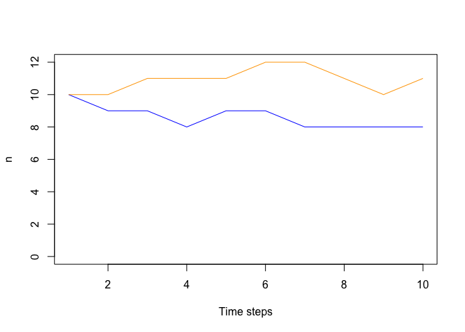
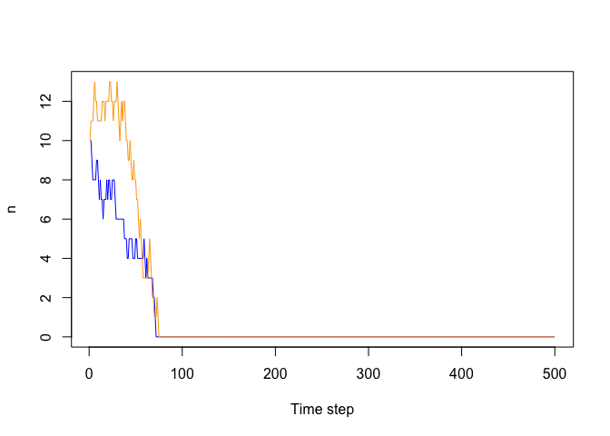
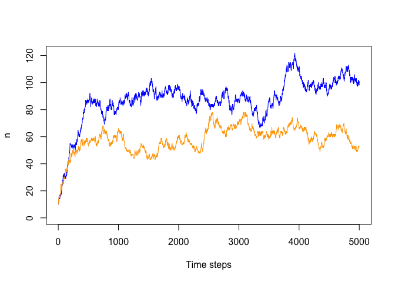

Notes on coding a Lotka-Volterra Model
================

Let’s start with just figuring out how we we code up two populations if
they had equal per-capita probabilities of birth and death. Hey! This is
just a simplified kind of neutral theory!

``` r
# initial population sizes
n <- c(10, 10)

# a matrix to hold populations sizes through time (rows are time points)
nmat <- matrix(0, nrow = 10, ncol = 2)
nmat[1, ] <- n # record the initial conditions

# birth or death?
# `event = 0` is death and `event = 1` is birth
event <- sample(0:1, 1)

if(event == 0) { # someone dies
    # who dies?
    thisOneDead <- sample(1:2, size = 1, prob = n)
    
    # update populations
    n[thisOneDead] <- n[thisOneDead] - 1
} else { # someone is born
    thisOneBorn <- sample(1:2, size = 1, prob = n)
    
    # update populations
    n[thisOneBorn] <- n[thisOneBorn] + 1
}

# now `n` has changed
n
```

    ## [1] 11 10

``` r
# update the matrix by hand
nmat[2, ] <- n
```

The issue here is that filling in that `nmat` matrix by hand would take
a *long* time. Luckily we can ask the computer to do the work for us
instead (and a lot faster). We use a for loop. Check out what a for loop
does

``` r
# initial population sizes
n <- c(10, 10)

# a matrix to hold populations sizes through time (rows are time points)
nmat <- matrix(0, nrow = 10, ncol = 2)
nmat[1, ] <- n # record the initial conditions

# here's the for loop, so called cause we use the word "for"
for(i in 2:10) {
    nmat[i, 1] <- i
}

nmat
```

    ##       [,1] [,2]
    ##  [1,]   10   10
    ##  [2,]    2    0
    ##  [3,]    3    0
    ##  [4,]    4    0
    ##  [5,]    5    0
    ##  [6,]    6    0
    ##  [7,]    7    0
    ##  [8,]    8    0
    ##  [9,]    9    0
    ## [10,]   10    0

So the for loop iterates over the values 2 through 10 and *for* each
value it assigns the value to `i` and then let’s us do anything we want
with `i`. Here we used `i` both to index the matrix, and to provide a
new value.

We can use a for loop to run our neutral simulation.

``` r
# initial population sizes
n <- c(10, 10)

# a matrix to hold populations sizes through time (rows are time points)
nmat <- matrix(0, nrow = 10, ncol = 2)
nmat[1, ] <- n # record the initial conditions

# here's the for loop, so called cause we use the word "for"
for(i in 2:10) {
    # birth or death?
    # `event = 0` is death and `event = 1` is birth
    event <- sample(0:1, 1)
    
    if(event == 0) { # someone dies
        # who dies?
        thisOneDead <- sample(1:2, size = 1, prob = n)
        
        # update populations
        n[thisOneDead] <- n[thisOneDead] - 1
    } else { # someone is born
        thisOneBorn <- sample(1:2, size = 1, prob = n)
        
        # update populations
        n[thisOneBorn] <- n[thisOneBorn] + 1
    }
    
    
    # update the matrix
    nmat[i, ] <- n
}

nmat
```

    ##       [,1] [,2]
    ##  [1,]   10   10
    ##  [2,]    9   10
    ##  [3,]    9   11
    ##  [4,]    8   11
    ##  [5,]    9   11
    ##  [6,]    9   12
    ##  [7,]    8   12
    ##  [8,]    8   11
    ##  [9,]    8   10
    ## [10,]    8   11

Now we can see `nmat` got totally filled in with a real simulation! We
could visualize it like this

``` r
plot(1:10, nmat[, 1], ylim = c(0, max(nmat)), col = 'blue', type = 'l', 
     xlab = 'Time steps', ylab = 'n')
lines(1:10, nmat[, 2], col = 'orange')
```

<!-- -->

The nice thing about a for loop is we can easily run it a lot longer to
see genuinely interesting dynamics

``` r
# initial population sizes
n <- c(10, 10)

# a matrix to hold populations sizes through time (rows are time points)
ntstep <- 500 # number of time steps
nmat <- matrix(0, nrow = ntstep, ncol = 2)
nmat[1, ] <- n # record the initial conditions

# here's the for loop, so called cause we use the word "for"
for(i in 2:ntstep) {
    # everything could going extinct, so this is a safety precaution 
    # it will stop the loop if everything is dead
    if(all(n <= 0)) break
    
    # birth or death?
    # `event = 0` is death and `event = 1` is birth
    event <- sample(0:1, 1)
    
    if(event == 0) { # someone dies
        # who dies?
        thisOneDead <- sample(1:2, size = 1, prob = n)
        
        # update populations
        n[thisOneDead] <- n[thisOneDead] - 1
    } else { # someone is born
        thisOneBorn <- sample(1:2, size = 1, prob = n)
        
        # update populations
        n[thisOneBorn] <- n[thisOneBorn] + 1
    }
    
    
    # update the matrix
    nmat[i, ] <- n
}

plot(1:ntstep, nmat[, 1], ylim = c(0, max(nmat)), col = 'blue', type = 'l', 
     xlab = 'Time step', ylab = 'n')
lines(1:ntstep, nmat[, 2], col = 'orange')
```

<!-- -->

But we’re not trying for a neutral model, we’re trying for
Lotka-Voltera. What do we need to do? We need to have per capita death
rates that are not all equal. Specifically for a species $i$ competing
with a species $j$ we need per capita death rate $D_i$ to be

$$
D_i = \mu_{i0} + \mu_{ii}n_i + \mu_{ij}n_j
$$

We also have to have a birth rate, but this is inconsequential in terms
of breaking neutrality. In fact we can just have both birth rates be the
same

$$
B_i = B_j = \lambda
$$

Let’s set values to these parameters

``` r
# birth
lambda <- 4

# intrinsic death rates
mu10 <- 0.2
mu20 <- 0.4

# intra-specific competition
mu11 <- 0.04
mu22 <- 0.06

# inter-specific competition 
mu12 <- 0.002
mu21 <- 0.003
```

Now we can write a new for loop with Lotka-Volterra death

``` r
# initial population sizes
n <- c(10, 10)

# a matrix to hold populations sizes through time (rows are time points)
ntstep <- 5000 # number of time steps
nmat <- matrix(0, nrow = ntstep, ncol = 2)
nmat[1, ] <- n # record the initial conditions

# here's the for loop, so called cause we use the word "for"
for(i in 2:ntstep) {
    # everything could going extinct, so this is a safety precaution 
    # it will stop the loop if everything is dead
    if(all(n <= 0)) break

    # birth or death?
    # death probabilities
    dprob1 <- n[1] * (mu10 + mu11 * n[1] + mu12 * n[2])
    dprob2 <- n[2] * (mu20 + mu22 * n[2] + mu21 * n[1])

    # birth probabilities
    bprob1 <- lambda * n[1]
    bprob2 <- lambda * n[2]

    # `event = 0` is death and `event = 1` is birth
    event <- sample(0:1, size = 1, prob = c(dprob1 + dprob2, bprob1 + bprob2))

    if(event == 0) { # someone dies
        # who dies?
        thisOneDead <- sample(1:2, size = 1, prob = c(dprob1, dprob2))

        # update populations
        n[thisOneDead] <- n[thisOneDead] - 1
    } else { # someone is born
        thisOneBorn <- sample(1:2, size = 1, prob = c(bprob1, bprob2))

        # update populations
        n[thisOneBorn] <- n[thisOneBorn] + 1
    }

    nmat[i, ] <- n
}


plot(1:ntstep, nmat[, 1], type = 'l', ylim = c(0, max(nmat)), col = 'blue', 
     xlab = 'Time steps', ylab = 'n')
lines(1:ntstep, nmat[, 2], col = 'orange')
```

<!-- -->

Now talk about modern coexist insight: $\rho < f/f < 1/\rho$

and bio interpretations

Then talk about how multi-spp falls apart in terms of predicting coexist

Can students find an example of where pairwise coexist is predicted, but
3-way doesn’t work?

simualte species rich community and look at SAD, look familiar?
